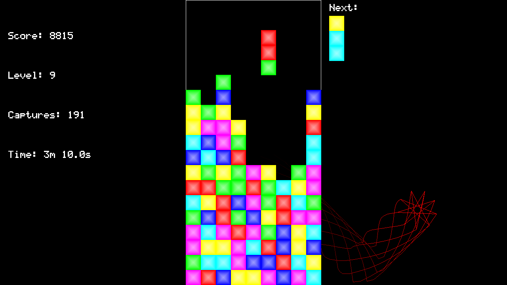

# Color Fall
Color Fall is one of many clones of the Sega Genesis game Columns. Like Tetris and Columns, Color Fall is a tile-matching puzzle game where polyominoes descend on a playing grid and depending on their placement sometimes cause other previously-placed tiles disappear.

### Game Play
In Color Fall 1x3 trominoes, with each tile being one of six random colors, descend onto a 9x19 playing grid. The object of the game is to form three-in-a-rows of the same color. This causes those tiles to be captured (and disappear), and increases the players score. As the level increases so will the speed at which the trominoes fall.

<p align="left">
  
</p>

### Keyboard Controls
In menus:
- **Up Arrow**, **Down Arrow** - Change the selected menu item
- **Left Arrow**, **Right Arrow** - Change the selected sub-menu item
- **Enter** - Performs the action associated with selected menu item
- **R** - Re-randomize the colors of the menu background
- **-**, **+** - Move the menu background forwards and backwards in time

During game play:
- **Left Arrow**, **Right Arrow** - Move the falling column left and right
- **Up Arrow** - Rotate the colors of the falling column
- **Down Arrow** - Immediately place the column on the grid
- **Escape** - Pause the game

### Requirements
- **git** - For cloning
- **Java Development Kit (JDK) 8** (or later) - For compiling and running
- **GNU Make** (or equivalent) - For build automation

### Installation Instructions
To download and compile this program enter the following commands in a terminal:

```
git clone https://github.com/Eirik0/game-template.git
git clone https://github.com/Eirik0/ColorFall.git
cd ColorFall
make
```